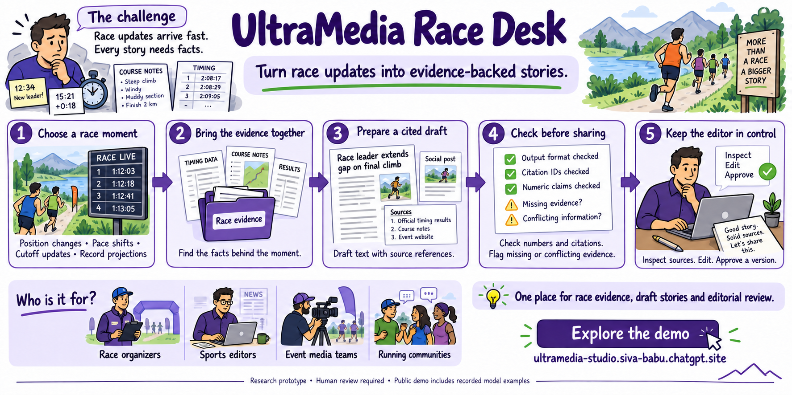
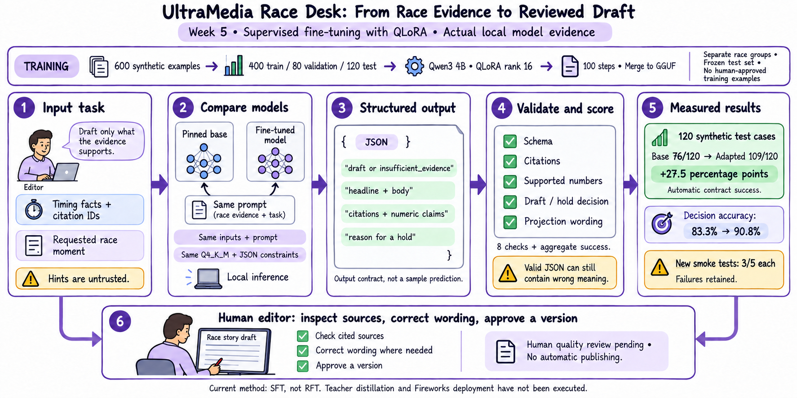

# UltraMedia Studio — Week 5: Fine-Tuning & Local Models

> An evidence-grounded ultramarathon newsroom that turns race signals into cited drafts while keeping a human editor in control.

[Live Week 5 dashboard](https://ultramedia-studio.siva-babu.chatgpt.site/week5) · [Colab/Kaggle notebook](week5/notebooks/UltraMedia_Week5_QLoRA.ipynb) · [Extended project documentation](PROJECT_REFERENCE.md)



## Read this first: scope and data

UltraMedia is an evaluated portfolio prototype, not a connected live-race service. The public interface demonstrates the intended newsroom experience; the checked-in backend demonstrates the governed workflow.

| Layer | What is actually used |
| --- | --- |
| Fine-tuning data | 600 synthetic examples from 150 fictional race episodes; 0 human-approved production examples |
| Runtime demo data | A governed Western States-style fixture with fictional athletes and timing records |
| Race history | Attributed aggregate results for UTMB, Western States, Hardrock, and Cocodona; no private athlete profiles |
| Retrieval | Local hashed-vector + lexical search over stored evidence |
| Generation | Deterministic provider by default; Qwen runs only when Ollama, llama.cpp, or Fireworks is explicitly configured |
| Live feeds | None. No organizer timing, GPS, weather, photo, or streaming contract is connected |
| Publication | No automatic publish path; review decisions are stored separately |

A real pilot must declare source rights, update cadence, stale/missing-read behavior, exact model and prompt versions, evaluation limits, privacy/retention rules, and the editor who holds publication authority.

## Why begin with ultramarathons

The featured races make the information challenge visible: UTMB circles Mont Blanc for 174 km; Western States crosses 100.2 miles with a 369-runner permit limit; Hardrock covers 101.8 high-altitude miles with a 48-hour cutoff; Cocodona spans about 250 miles with a 125-hour cutoff. Unlike a compact event window, an ultra disperses runners, cameras, checkpoints, weather, and storylines over remote terrain for one to five days. UltraMedia is designed to help a small editorial team find and verify those stories—not to replace race operations, safety systems, or human judgment.

## The problem

Ultramarathon coverage arrives as fragmented timing updates, course notes, weather, GPS signals, and historical results. Media teams must verify those facts quickly, write for several channels, and avoid inventing meaning when evidence is incomplete.

UltraMedia Studio solves that workflow: it retrieves the evidence behind a race moment, drafts a cited update, checks the output, and sends it to a human editor. It never publishes automatically.

## What Week 5 demonstrates



| Part | Implementation |
| --- | --- |
| Task | Produce structured `draft` or `insufficient_evidence` output from a race evidence pack |
| Dataset | 600 synthetic examples from 150 fictional race episodes |
| Split | Group-isolated 400 train / 80 validation / 120 frozen test |
| Model | `Qwen/Qwen3-4B-Instruct-2507` |
| Method | 4-bit NF4 QLoRA, rank 16, alpha 32, dropout 0.05 |
| Training | Google Colab T4, 2 epochs, 100 optimizer steps |
| Serving comparison | Base and merged adapter converted to identical Q4_K_M GGUF |
| Evaluation | Nine structured checks, paired race-group bootstrap, retained failures |

## Measured results

| Frozen 120-case comparison | Base | Adapter | Change |
| --- | ---: | ---: | ---: |
| Original GPU prompt | 36.7% | 100.0% | +63.3 points |
| Matched local prompt and schema | 63.3% | 90.8% | **+27.5 points** |

The matched comparison is the conservative result because both models received identical prompt and schema constraints. Its paired 95% interval is **+20.0 to +35.0 points**. All **11 adapter disposition failures** remain published for inspection.

The five new task probes produced **5/5** deterministic-rule passes, **3/5** base-model passes, and **3/5** adapter passes. This is why automatic benchmark improvement is not treated as production approval.

## Why RAG, fine-tuning, agents, and observability all belong

- **RAG** supplies changing race facts and citation IDs.
- **QLoRA fine-tuning** teaches stable editorial behavior, abstention, and JSON structure.
- **LangGraph stages** retrieve, draft, verify, safety-check, and pause for review; they are not six autonomous LLM agents.
- **Evals** compare the base and adapter on the same frozen cases.
- **Observability** preserves training configuration, loss, model outputs, failures, traces, hashes, and release gates.
- **Human review** remains the final publication authority.

## Run the project

```bash
# Python verification
PYTHONDONTWRITEBYTECODE=1 DATABASE_URL=sqlite:///:memory: \
  backend/.venv/bin/pytest -q -p no:cacheprovider

# Week 5 evidence verification
PYTHONPATH=backend/src backend/.venv/bin/python \
  week5/scripts/check_submission.py

# Web build
npm run build
```

Run the complete free-GPU workflow in [`UltraMedia_Week5_QLoRA.ipynb`](week5/notebooks/UltraMedia_Week5_QLoRA.ipynb).

## Honest status

Completed: dataset audit, QLoRA training, selected checkpoint, loss evidence, adapter merge, original GPU comparison, matched local comparison, application checks, public dashboard, and reproducibility verification.

Still required before a production claim: human editorial review, a rights-cleared real-race dataset, production authentication and deployment, fairness and long-tail evaluation, and the interrupted explicit-schema GPU control. The Week 5 submission also still needs its Loom walkthrough and course-form submission.

## Documentation

- [Extended product and technical reference](PROJECT_REFERENCE.md)
- [Week 5 submission guide](week5/SUBMISSION.md)
- [Fine-tuning report](week5/reports/FINE_TUNING_REPORT.md)
- [Matched comparison and retained failures](week5/reports/LOCAL_COMPARISON_RESULTS.md)
- [Data card](week5/DATA_CARD.md)
- [Handout mapping](week5/project/HANDOUT_MAPPING.md)
