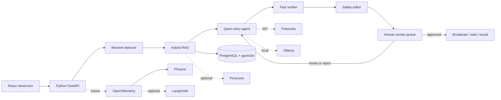

# UltraMedia Studio architecture

## Product boundary

UltraMedia is a newsroom copilot, not an autonomous publisher, race official, medical monitor, athlete-ranking authority, or safety dispatch system. It can detect data patterns and draft stories; an authenticated editor owns every publication decision.

## Request flow

## Why Python is the main language

Python owns ingestion, feature computation, model access, RAG, agent orchestration, fine-tuning, evaluation, observability, and the API. TypeScript is retained only for the browser experience because the current deployed site uses React and Vinext.

## Data model

- `races`: organizer-owned event identity and operating status
- `timing_events`: append-only checkpoint observations
- `knowledge_chunks`: attributed course, rules, weather, and history passages with embeddings
- `story_drafts`: structured generated content, confidence, citations, and publication state
- `approvals`: append-only human decisions and rationale
- `trace_spans`: metadata-only stage timing and status

SQLite supports the zero-cost demo. PostgreSQL is the production system of record. pgvector can absorb the first retrieval workloads; Pinecone remains an optional managed path when scale or operational isolation justifies it.

## RAG versus fine-tuning

- RAG contains facts that change: timing, cutoffs, weather, entrants, course notes, and results.
- QLoRA teaches stable behavior: editorial voice, JSON structure, headline discipline, citation placement, and abstention style.
- Prompts contain request-specific constraints and channel format.
- The fact verifier rejects citations outside the retrieved evidence set.

## Agent responsibilities

1. **Moment detector** validates and classifies an incoming signal.
2. **Evidence retriever** combines timing context with dense and lexical retrieval.
3. **Story writer** creates a structured multi-channel draft.
4. **Fact verifier** validates allowed citation identifiers and release confidence.
5. **Safety editor** blocks unsupported injury, health, emotion, or intent claims.
6. **Human review queue** persists a pending draft; it cannot publish.

## Massive-data evolution

For a multi-race commercial platform, raw feeds land in object storage as immutable, date-partitioned Parquet. A Python stream consumer normalizes race-specific schemas into canonical checkpoint events. PostgreSQL holds operational state; an analytical engine such as DuckDB or ClickHouse handles historical cohort queries. The current repository implements the canonical schema and governed CSV ingestion boundary without pretending to have organizer data rights.

## Reliability and security controls

- Allowlisted CORS origins and optional reviewer API key
- Idempotent demo ingestion
- Parameterized SQL through SQLAlchemy
- Provider timeouts and fail-closed validation
- No auto-publication from the model workflow
- Synthetic public demo data and attributed course sources
- Separate namespaces/projects for each environment and race series
- Trace metadata excludes raw prompts and full generated narratives

