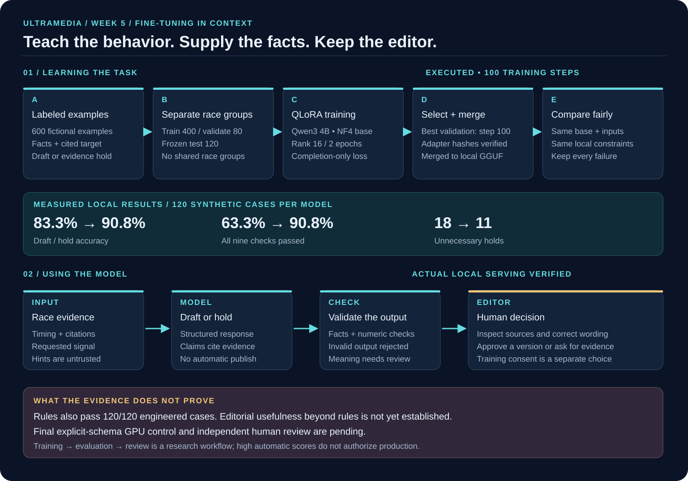
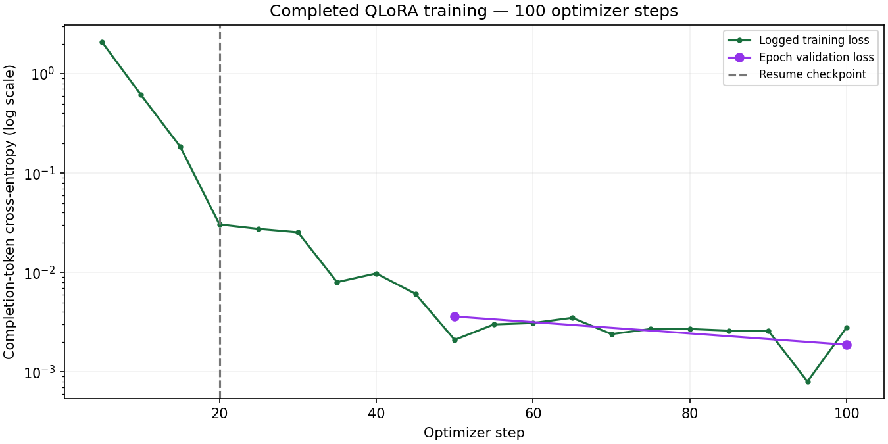

# UltraMedia Week 5 Project Report

## Open model fine tuning for evidence based race reporting

Prepared for The Gen Academy Week 5 custom project review • 9 September 2026

UltraMedia Race Desk helps an editor turn race timing evidence into a cited draft, or hold the request when evidence is missing or contradictory. We fine-tuned an open Qwen model to learn that response behavior, merged its adapter for local inference, and compared the result with the same unadapted model. The project connects supervised fine-tuning to an observable editorial workflow and preserves the data needed to inspect its successes and failures.

**Main finding:** on 120 frozen synthetic test cases, the matched local model comparison improved automatic contract success from **76/120 to 109/120**, a **27.5 percentage-point gain**. Draft-versus-hold decision accuracy improved from **100/120 to 109/120**, a separate **7.5-point gain**. Both models used identical JSON-schema constraints. These results support a narrow learned-behavior improvement; they do not establish human editorial preference or production readiness.

| Evidence at this report snapshot | Result |
|---|---|
| Completed fine-tuning | 100 steps over 2 epochs; checkpoint 100 selected |
| Dataset | 600 synthetic examples; 400 train, 80 validation, 120 test |
| Matched local automatic success | Base 63.33%; adapted 90.83% |
| Original GPU automatic success | Base 36.67%; adapted 100%; prompt-format limitation |
| Additional five smoke cases | Rules 5/5; base 3/5; adapted 3/5 |
| Application verification | 13 software checks passed; separate model quality suite failed one case |
| Submission and research status | Loom and form submission pending; extra GPU control incomplete |

The recommended decision is to retain deterministic handling for fully structured evidence decisions and keep the adapted model as an editorial research candidate. Rules already pass the engineered benchmark. Measured editorial usefulness must justify replacing them.

**Reviewer entry points:** [Public Week 5 evidence page](https://ultramedia-studio.siva-babu.chatgpt.site/week5), [GitHub handout project and assets](https://github.com/sivalinb/ultramedia-studio/tree/ab9ddd5d9f2aafa8b1998c89330890598af857c7/week5), and [recorded project walkthrough](https://github.com/sivalinb/ultramedia-studio/blob/ab9ddd5d9f2aafa8b1998c89330890598af857c7/week5/evidence/handout-page/project-walkthrough.webm).

This report maps all four pages of the supplied **Week 5 Project Handout (Aug 2026).pdf**. The custom GitHub-plus-Loom route is explicitly allowed. The course determines pass/fail and award selection; a completed report cannot certify that every requirement has passed.

<!-- pagebreak -->

## 1 Week 5 requirement checklist

The standard lab trains a seven-class support-ticket router. UltraMedia is a custom editorial application with two predicted decisions: `draft` and `insufficient_evidence`. “Implemented” below means an evidenced custom counterpart exists. It does not claim that the exact standard notebook was executed.

| Handout requirement | UltraMedia counterpart and evidence | Status |
|---|---|---|
| Business task and downstream action, pp 1–2 | Supported draft goes to editor review; insufficient evidence produces a hold. Business decision documented. | Implemented; benefit unmeasured |
| Phase 1 Install, p 2 | Actual Colab Tesla T4 run; pinned TRL, PEFT and bitsandbytes dependencies; environment receipt. | Custom equivalent |
| Phase 2 Prepare data, pp 2–3 | 600 labeled chat records; group-isolated 400/80/120 split; hashes and inventory. | Custom equivalent |
| Phase 3 Train LoRA, pp 2–3 | Frozen NF4 Qwen3 4B base with rank-16 adapters; 2 epochs and 100 steps completed. | Custom equivalent |
| Explain LR, epochs, batch and rank, p 3 | Settings, rationale and adjustment criteria in section 4. | Documented |
| Phase 4 Review loss, pp 2–3 | Actual training curve and both epoch validation losses; checkpoint 100 selected. | Completed |
| Phase 5 Merge, pp 2–4 | Adapter merged with exact pinned base; matched GGUF conversion and byte checks. | Completed |
| Five obvious smoke inputs, p 4 | Five custom probes executed against rules, base and adapter; all 15 raw outputs retained. | Executed; models only 3/5 |
| Phase 6 Classification metrics, pp 3–4 | Precision, recall, F1, support and confusion matrices for draft versus hold. | Completed; post-hoc analysis |
| Fair same-base comparison, p 4 | Same pinned model, 120 inputs, prompt, runtime and quantization; both local arms constrained. | Completed locally |
| Faster and cheaper systems decision, p 1 | Latency measured; costs and editor effort explicitly unmeasured. | Partial |
| Custom GitHub assets plus Loom, p 4 | Git assets, notebook, reports, raw predictions and browser recordings exist. | Git ready; Loom pending |
| Submit by stated deadline, pp 1 and 4 | Submission checklist and form link prepared. | Not submitted |

The smoke-test result is a real unresolved quality gap. The five additional probes were run after the main evaluation, so their execution order also differs from the lab's smoke-before-full-evaluation sequence. Negative evidence is retained rather than relabeled as a pass.

The handout allows custom projects but does not explicitly waive every model, tool or split choice. The differences in section 2 make those choices reviewable. [Detailed handout mapping](https://github.com/sivalinb/ultramedia-studio/blob/ab9ddd5d9f2aafa8b1998c89330890598af857c7/week5/project/HANDOUT_MAPPING.md).

<!-- pagebreak -->

## 2 Project flow and custom design choices



Race evidence enters the application as source material. A moment detector and retriever assemble the relevant facts. The selected writer produces structured output, then factual and safety checks validate it. An editor reviews the saved draft and trace. Review decisions preserve revisions and explicit training-consent information; approval does not itself publish externally.

Fine-tuning teaches output structure, evidence use and abstention behavior. Current race facts remain in the request. Retrieval supplies those facts; fine-tuning does not make changing race information part of the model's permanent knowledge.

| Standard lab choice | Custom choice and reason |
|---|---|
| Seven IT resolver labels | Binary draft/hold decision plus cited editorial text; supplied race signal types are input strata, not predicted classes. |
| Qwen3-1.7B-Base | Qwen3-4B-Instruct-2507 supports the chosen structured-generation task. No experiment establishes superiority over 1.7B. |
| LLaMA-Factory and Board | Scripted TRL/PEFT training records settings, loss, checkpoints and recovery. No Board execution is claimed. |
| CSV, ShareGPT registration, 80/20 | Versioned chat JSONL with a separate frozen test set; race groups cannot cross splits. |
| Merged classify function | Merged GGUF model behind a validated story-generation API, with a separate disposition analysis. |

The flow illustrates implemented paths and explicitly pending review/control work. It is not evidence that every depicted stage has completed. [Editable Mermaid and SVG diagram sources](https://github.com/sivalinb/ultramedia-studio/tree/ab9ddd5d9f2aafa8b1998c89330890598af857c7/week5/diagrams).

<!-- pagebreak -->

## 3 Dataset and supervised targets

The version `ultramedia-synthetic-research-v1` contains fictional race episodes generated by the project. It contains no human-approved examples and is not a scrape of private athlete records. Dataset provenance is labeled CC0-1.0; the base model has a separate license. Synthetic labels demonstrate a controlled learning task, not independent editor judgment.

| Split | Examples | Race groups | Draft targets | Hold targets | Purpose |
|---|---:|---:|---:|---:|---|
| Train | 400 | 100 | 240 | 160 | Gradient updates |
| Validation | 80 | 20 | 48 | 32 | Checkpoint selection |
| Test | 120 | 30 | 72 | 48 | Frozen comparison |
| Total | 600 | 150 | 360 | 240 | Versioned corpus |

Each race group provides four signal examples: position change, projected record margin, cutoff buffer and pace change. Five conditions test complete, missing, contradictory, misleading-hint and boundary evidence. Every signal/condition cell has 20 training, 4 validation and 6 test examples. This balance is an experimental design rather than a measured live-race distribution.

The audit finds zero shared race groups and zero exact message-payload overlaps between splits. Repeated templates and task structure remain shared. Group isolation prevents specific leakage paths; it does not demonstrate generalization to independently written reporting.

Each target contains `disposition`, `eyebrow`, `headline`, `body`, `social_caption`, `citation_ids`, `claims` and `reason`. A structured claim carries a metric, numeric value and citation ID. Supported evidence should produce a draft with traceable claims. Missing or contradictory evidence should produce a reasoned hold. A misleading headline hint must not override source facts.

The pinned tokenizer measured **476–622 tokens per complete message sequence**, mean **554.02**, across all 600 examples. The configured limit is 2,048, and overlength examples are rejected instead of silently truncated. Packing is disabled. Completion-only supervised fine-tuning masks the prompt tokens; the actual GPU collator receipt records **424 masked and 116 supervised tokens** for its inspected example. Whole-sequence counts are not supervised-token counts.

For a traceable example, the [five annotated training records](https://github.com/sivalinb/ultramedia-studio/blob/ab9ddd5d9f2aafa8b1998c89330890598af857c7/week5/reports/data/annotated-training-examples.json) retain exact inputs, messages, target JSON and provenance. Selection uses the first training record for each condition, without selecting on test performance.

Evidence: [Data report and inventory](https://github.com/sivalinb/ultramedia-studio/blob/ab9ddd5d9f2aafa8b1998c89330890598af857c7/week5/reports/DATA_REPORT.md), [frozen dataset and manifest](https://github.com/sivalinb/ultramedia-studio/tree/ab9ddd5d9f2aafa8b1998c89330890598af857c7/week5/data/synthetic).

<!-- pagebreak -->

## 4 Fine tuning configuration and loss review

Supervised fine-tuning learns from the reference assistant completions. LoRA trains small low-rank weight updates while the base remains frozen. QLoRA adds a quantized base to reduce training memory. Our run used NF4 double quantization and **33,030,144 trainable parameters**. It did not perform full-parameter fine-tuning, DPO or RLHF.

| Setting | Recorded value | Interpretation |
|---|---|---|
| Learning rate | 0.0002; cosine schedule; 5% warmup | Controls update size; reduce if loss oscillates. |
| Epochs | 2; 100 optimizer steps | Two passes; select using validation, not test scores. |
| Batch | 1 per device; accumulate 8 | Effective batch 8 on one GPU; reduces memory demand. |
| LoRA | Rank 16; alpha 32; dropout 0.05 | Modest adapter capacity; no rank sweep was run. |
| Target modules | q, k, v, o, gate, up, down projections | Attention and feed-forward linear layers. |
| Optimizer and seed | Paged AdamW 8-bit; seed 42 | Recorded for reproducibility; only one training seed. |
| Supervision | Completion only; limit 2048; no packing | Prompt labels masked; preserve complete targets. |



Validation loss decreased from **0.00360627 at step 50** to **0.00187708 at step 100**. Checkpoint 100 had the lower recorded validation loss and was selected. Falling loss shows fit to this target format; very low loss on repetitive synthetic data does not establish broad reasoning or editorial quality.

The actual Colab Tesla T4 receipt reports `torch.bfloat16`, peak allocated memory **4,384,457,216 bytes**, and peak reserved memory **5,903,482,880 bytes**. The reported **97.45 minutes** covers the resumed training invocation only; earlier interruptions, setup and later evaluation are excluded. The recorded dtype is not a claim of native T4 BF16 acceleration.

Evidence: [final run manifest, history, curve and verification](https://github.com/sivalinb/ultramedia-studio/tree/ab9ddd5d9f2aafa8b1998c89330890598af857c7/week5/reports/data/final-training).

<!-- pagebreak -->

## 5 Evaluation design and measured comparisons

The primary local comparison holds the base revision, input identities, prompt, converter, quantization and runtime constant. Both arms use Q4_K_M on an Apple M1 Max with 64 GiB RAM, JSON-schema constrained decoding, temperature 0, seed 42 and a 1,024-token output limit. All 120 cases are retained. The protocol was committed before base-model evaluation.

The score commonly called “all nine checks” in earlier project material is the `automatic_success` aggregate in a nine-metric report: eight constituent checks plus the aggregate itself. Passing requires valid schema, valid citations, supported structured claims, required-metric coverage, correct disposition, supported numeric tokens, the selected sensitive-language check and projection-versus-achievement handling. It is not comprehensive semantic accuracy.

| Experiment | Base passing | Adapted passing | Interpretation |
|---|---:|---:|---|
| Matched local, schema constrained | 76/120; 63.33% | 109/120; 90.83% | +27.5 points; paired 95% interval 20–35 points |
| Original T4 GPU, NF4 | 44/120; 36.67% | 120/120; 100% | +63.33 points; original prompt has format ambiguity |
| Explicit-schema T4 GPU control | 36/120; 30% | Incomplete | No paired result; adapter arm interrupted |

The local interval uses 1,000 paired bootstrap resamples of race groups with seed 42. Pairing preserves model comparisons within cases and group resampling reflects the four examples per race. The interval describes sampling variation within this dataset; it does not cover training-seed or deployment variation.

Both local arms achieved **120/120 valid schemas**, so their measured gain extends beyond JSON formatting. Paired outcomes were 76 cases passing both, 33 improved, zero regressed and 11 failing both. Under misleading hints, adapted success was only **13/24**. All 11 adapted failures involved unnecessary abstention.

The original GPU baseline achieved only 73/120 schema-valid outputs. Its large gain therefore includes response-format learning and cannot be presented as a pure reasoning gain. The explicit-schema control base performed worse, not better, than the original baseline. That control remains incomplete because compatible Colab capacity was unavailable after interruption; completing its adapter arm is an additional project commitment, not a handout requirement for three experiments.

These experiments use different prompts, quantization or decoding and must remain separate. A future Fireworks comparison must rerun both arms under its own recorded deployment conditions.

Evidence: [matched local results and every metric](https://github.com/sivalinb/ultramedia-studio/blob/ab9ddd5d9f2aafa8b1998c89330890598af857c7/week5/reports/LOCAL_COMPARISON_RESULTS.md), [original GPU results](https://github.com/sivalinb/ultramedia-studio/blob/ab9ddd5d9f2aafa8b1998c89330890598af857c7/week5/reports/ORIGINAL_GPU_RESULTS.md).

<!-- pagebreak -->

## 6 Classification report and asymmetric errors

To match the handout's classification view, we derived draft-versus-hold metrics from all 240 saved local predictions. This is a **post-hoc descriptive analysis**, without new inference, prompt changes or retraining. It supplements the original aggregate metric. The four race signal types were supplied as inputs and are not four learned output classes.

| Class and model | Precision | Recall | F1 | Support |
|---|---:|---:|---:|---:|
| Draft base | 0.9643 | 0.7500 | 0.8438 | 72 |
| Draft adapted | 1.0000 | 0.8472 | 0.9173 | 72 |
| Hold base | 0.7188 | 0.9583 | 0.8214 | 48 |
| Hold adapted | 0.8136 | 1.0000 | 0.8972 | 48 |

| Overall decision measure | Base | Adapted |
|---|---:|---:|
| Accuracy | 83.33% | 90.83% |
| Macro F1 | 0.8326 | 0.9072 |

Precision asks how often a predicted class is correct. Recall asks how often a reference class is found. F1 balances precision and recall; support is the number of reference examples. Macro F1 gives the two classes equal weight.

### Confusion matrices

Rows below are reference classes and columns are model predictions. “Hold” means `insufficient_evidence`.

| Reference class | Base draft | Base hold | Adapted draft | Adapted hold |
|---|---:|---:|---:|---:|
| Draft | 54 | 18 | 61 | 11 |
| Hold | 2 | 46 | 0 | 48 |

An unsupported draft risks presenting a claim without adequate evidence. An unnecessary hold creates extra editor work or delays a supported update. The adapted model removes two unsupported draft decisions in this sample and reduces unnecessary holds from 18 to 11. The residual 11 errors all occur under misleading hints. Zero observed unsupported decisions among 48 hold references is not a guarantee of zero future risk.

The **7.5-point classification gain** must remain separate from the **27.5-point aggregate gain**. Changes in numeric and other contract checks explain why those deltas differ. Neither local arm had invalid-schema outputs; experiments with malformed outputs must retain those failures explicitly rather than dropping them from the denominator.

The verifier checks case IDs, group IDs, input hashes, raw dispositions and consistency with the original saved check. [Classification report, 240-row CSV and analysis JSON](https://github.com/sivalinb/ultramedia-studio/blob/ab9ddd5d9f2aafa8b1998c89330890598af857c7/week5/reports/DISPOSITION_RESULTS.md).

<!-- pagebreak -->

## 7 Smoke tests and remaining quality failures

Five newly authored synthetic probes were frozen with the runner in local commit `5b39c2b06f5e1c01d5dd26158a992337d9eaabc5` before model inference. They used the existing model artifacts, prompt and validators. This local declaration is distinct from the published evidence commit. All 15 first-attempt outputs are retained; no successful retry replaces a failure.

| Probe | Expected decision | Rules | Base | Adapted |
|---|---|---|---|---|
| Supported position loss | Draft | Pass | Pass | Pass |
| Projected record margin | Draft | Pass | Pass | Pass |
| Missing cutoff evidence | Hold | Pass | Pass | Fail |
| Conflicting pace evidence | Hold | Pass | Fail | Pass |
| Misleading hint with evidence | Draft | Pass | Fail | Fail |
| Total | Five cases | 5/5 | 3/5 | 3/5 |

The adapted model made the correct hold decision on missing evidence but invented citation ID `timing`; citation validation rejected it. Both learned models unnecessarily held the misleading-hint example. The base also failed numeric-token support on contradictory pace evidence. This probe shows no adapted-model advantage over the base.

Contract checks leave important blind spots. In an earlier local position-change example, the base describes movement from 34th to 35th as gaining a place even though its structured value is -1. Automatic checks can pass despite that semantic mismatch. Adapted wording also contains “lost 1 places,” which the grammar-blind contract does not reject.

The new adapted record-projection output says 60 seconds behind, while the project's positive-margin convention means ahead. The new excerpt did not repeat the convention, so the report treats this as a semantic and input-portability ambiguity rather than a completed human adjudication. Its passing automatic score remains unchanged.

The sensitive-language metric flagged 23 original local base outputs, including denials of unsupported injury claims. Those flags are not evidence of 23 harmful medical assertions. Keeping the frozen metric supports comparison; explaining its limitations prevents overclaiming.

A separate six-case application workflow suite passed four retrieval cases and position-change generation, but failed record-watch generation for missing the requested metric and selecting the wrong disposition. Thirteen passing browser software checks therefore do not mean the model quality suite passed.

Future fixes should version the model or prompt, clarify sign conventions, address evidence-only citations and misleading hints, and evaluate on a fresh challenge set. Repeatedly tuning against these exposed failures would weaken their value as held-out evidence. [Smoke inputs, raw outputs and analysis](https://github.com/sivalinb/ultramedia-studio/blob/ab9ddd5d9f2aafa8b1998c89330890598af857c7/week5/reports/HANDOUT_SMOKE_RESULTS.md).

<!-- pagebreak -->

## 8 Open model serving and the user experience

The trained base is **Qwen/Qwen3-4B-Instruct-2507**, pinned to revision `cdbee75f17c01a7cc42f958dc650907174af0554`. Its published weights use Apache 2.0. Open weights let a reviewer inspect the model identity and reproduce local serving without relying on a proprietary model API. They do not make compute, integration or editorial labor free. [Official model card](https://huggingface.co/Qwen/Qwen3-4B-Instruct-2507).

The completed local path merges the trained adapter into the exact base, converts to F16 GGUF, then quantizes to Q4_K_M. Both comparison models use the same converter and quantizer lineage. The final adapted artifact serves through a local model endpoint connected to the Python API. The project retains artifact hashes and real browser-to-model calls.

An editor selects a race moment, inspects the evidence, requests generation, and receives either a reviewable draft or a failure/hold. Supported drafts include citations and structured claims. Authentication and revision checks protect review updates. The application retains original and edited versions, notes and explicit consent; automated QA approvals have training consent disabled and are not human training examples.

The public Week 5 page provides a flow diagram, recorded examples, interactive results, confusion matrices, a hypothetical cost calculator and downloadable evidence. Its recorded model demonstrations are labeled as evidence. The public page does not itself host the Python model endpoint, and public replay is not live cloud inference.

| Serving choice | Current state | Contribution |
|---|---|---|
| Pinned open model locally | Actual training, merge, comparison and browser evidence complete | Reproducible demonstration using existing hardware |
| Fireworks inference | Existing provider code; custom deployment not performed | Optional public generation after API hosting and budget approval |
| Different or smaller open model | Not trained in this experiment | Future comparison; separate lineage and evaluation required |

Fireworks can host compatible externally trained LoRA models on dedicated deployments. Exact pinned-base compatibility and budget must be confirmed before provisioning. Upload would use the Hugging Face adapter or supported merged weights, rather than the local GGUF. The Python API and database still need suitable hosting. A Fireworks run would be a separate runtime comparison, not completion of the frozen T4 control. [Fireworks deployment documentation](https://docs.fireworks.ai/fine-tuning/deploying-loras).

No Fireworks spending, deployment or model-quality improvement is claimed. Optional hosting is lower priority than honest evaluation, a clear Loom demonstration and submission packaging. [Actual adapted application evidence](https://github.com/sivalinb/ultramedia-studio/tree/ab9ddd5d9f2aafa8b1998c89330890598af857c7/week5/evidence/adapter-serving).

<!-- pagebreak -->

## 9 Business decision and editorial validation

The handout frames fine-tuning as a systems decision. UltraMedia should therefore answer whether the learned component earns its cost in the editorial workflow. Current evidence supports improved contract behavior relative to the prompted base, but not a production benefit over rules.

| Decision evidence | Rules | Local base | Local adapted |
|---|---:|---:|---:|
| Frozen automatic success | 120/120 | 76/120 | 109/120 |
| Five additional smoke probes | 5/5 | 3/5 | 3/5 |
| Model-request p50 latency | Not comparable | 4.622 s | 1.801 s |
| Model-request p95 latency | Not comparable | 5.907 s | 2.266 s |
| Editor acceptance and correction effort | Unmeasured | Unmeasured | Unmeasured |

The deterministic baseline shares the task rules with the synthetic target generator. Its perfect score is not independent generalization evidence, but it shows that a language model is unnecessary for these fully structured decisions. Potential learned value lies in useful wording and handling more varied evidence, which has not yet been demonstrated with editors.

Local timing measures sequential model HTTP requests with differing output lengths. It does not isolate model throughput or include editorial correction. Rules were timed in-process with a different boundary. No comparison here proves lower total cost than a frontier model or a human workflow.

Cost per accepted brief should include amortized training, serving for every attempt, retries and editor labor, divided by accepted briefs. If accepted briefs are zero, the measure is undefined. A break-even volume exists only when recurring savings per accepted brief are positive. The public calculator uses explicit hypothetical inputs, not measured ROI or live provider pricing.

### Proposed human study

A blind A/B/C packet and blank 15-row review template are prepared for the five cases across rules, base and adapter. The assignment key remains private. No reviewer judgments have been collected. This pilot can identify wording and factual-meaning issues but is too small to establish production benefit.

Before promotion, use a fresh set of independently authored, rights-cleared examples and record factual errors, acceptance, correction minutes, readability, ties and neither-acceptable outcomes. Keep evaluation examples separate from future training. Any reuse for training requires explicit consent and a new independent test set.

**Current decision:** keep deterministic structured handling and retain the model in research status. Independent human review is a project-defined production condition; it is not a universal submission requirement in the supplied handout. [Business case](https://github.com/sivalinb/ultramedia-studio/blob/ab9ddd5d9f2aafa8b1998c89330890598af857c7/week5/project/BUSINESS_CASE.md) and [blind review protocol](https://github.com/sivalinb/ultramedia-studio/blob/ab9ddd5d9f2aafa8b1998c89330890598af857c7/week5/project/HUMAN_REVIEW.md).

<!-- pagebreak -->

## 10 Reproducibility and evidence integrity

Use the [pinned source snapshot](https://github.com/sivalinb/ultramedia-studio/tree/ab9ddd5d9f2aafa8b1998c89330890598af857c7) to inspect this report's underlying evidence. New model runs should use a new output directory and retain their resolved environment. Exact scientific reproduction also depends on the recorded model weights, tokenizer, prompts, packages, hardware and decoding conditions.

From a repository checkout, a metadata-only verification of the public evidence can run without loading model weights:

```bash
python -m venv .venv
.venv/bin/python -m pip install -e 'backend[dev]'
PYTHONPATH=backend/src .venv/bin/python week5/scripts/verify_handout_evidence.py
PYTHONPATH=backend/src .venv/bin/python week5/scripts/verify_local_comparison.py \
  week5/evidence/local-comparison --metadata-only
```

Metadata-only verification recomputes saved results but does not prove model-file identity. To verify local model bytes, omit that flag and supply the downloaded base and adapted GGUF paths using the verifier's `--base-model` and `--adapter-model` arguments. Large weights are retained separately from Git; a Git checkout alone does not contain them.

Training is reproduced through the supplied [Colab and Kaggle notebook](https://github.com/sivalinb/ultramedia-studio/blob/ab9ddd5d9f2aafa8b1998c89330890598af857c7/week5/notebooks/UltraMedia_Week5_QLoRA.ipynb) and pinned GPU requirements. The run uses synthetic data under an explicit research flag. Recovery restores checkpoints and validates experiment identity; it does not authorize changing test cases or settings while retaining old conclusions.

| Artifact identity | SHA or revision |
|---|---|
| Evidence source commit | ab9ddd5d9f2aafa8b1998c89330890598af857c7 |
| Dataset SHA-256 | 5c148b3d1e57a989e38c55e73f1d46ae0b5b17227be154457953bac2dcaef8cf |
| Trained adapter SHA-256 | 0818dda9c8a2653df1de3199fd321a71b9cc178895eac8e42fa3a68ac37c28e4 |
| Base Q4_K_M SHA-256 | 39ccbecc6b48c63cbb57b789f558e66d15a9e9d65272ade7e9e0b81b2153fbc2 |
| Adapted Q4_K_M SHA-256 | ac3d4d36947c9412e5dbd884a705b2223315bef9cb19028209b2c263743a6b24 |

The executed environment records Python 3.13.15, torch 2.8.0, transformers 4.56.2, TRL 0.23.1, PEFT 0.17.1, datasets 4.1.1, accelerate 1.10.1 and bitsandbytes 0.47.0. Local conversion used llama.cpp converter commit `30b6a755e29692e8bc8e072885325716a2fee70f`.

Recorded verification includes 33 backend tests, TypeScript/build checks, 13 adapted-model browser software checks and public desktop/mobile evidence-page checks. These are timestamped engineering results, not proof of model semantics or perpetual deployment health. [Full reproduction and artifact ledger](https://github.com/sivalinb/ultramedia-studio/blob/ab9ddd5d9f2aafa8b1998c89330890598af857c7/week5/reports/FLOW_AND_REPRODUCIBILITY.md).

<!-- pagebreak -->

## 11 Submission package and remaining actions

The supplied handout states **Sunday 13 September 2026 at 11:59 p.m. Pacific Time** for Builder of the Week consideration and specifies pass/fail evaluation. The custom route asks for a GitHub link with all assets and a Loom video. This report organizes the evidence for that route; no award score or successful form submission is claimed.

| Action | Current evidence | Completion condition |
|---|---|---|
| Present the project and learning flow | Public page, this report and editable diagrams | Ready to demonstrate |
| Show training and comparison | Actual curve, manifests, raw outputs, class metrics and failures | Ready to inspect |
| Address five-case weakness | All first-attempt results retained; models only 3/5 | Future versioned repair and fresh evidence; do not claim all-pass |
| Publish Loom | Silent browser videos and narration script prepared | Record/upload and verify an accessible Loom URL |
| Submit custom project | Git assets and checklist prepared | Submit GitHub and Loom links through the form |
| Finish extra GPU control | Base arm saved; adapter interrupted | Recover compatible capacity and verify the missing arm |
| Establish editorial benefit | Blind packet prepared; no judgments | Actual editor assessment before production promotion |

### Suggested demonstration sequence

1. Show a race evidence pack and explain why the editor needs a supported draft or a hold.
2. Trace one real training record through the split, QLoRA configuration, loss curve and merged model.
3. Show matched base/adapted outputs, distinguish aggregate success from decision accuracy, and inspect a confusion-matrix error.
4. Show the actual adapted application recording and a retained failure. Explain why rules remain the current choice for structured decisions.
5. Open the Git evidence folder, identify reproduction steps and state the remaining limitations.

The existing [walkthrough script](https://github.com/sivalinb/ultramedia-studio/blob/ab9ddd5d9f2aafa8b1998c89330890598af857c7/week5/project/DEMO_AND_SUBMISSION.md) recommends three to four minutes; that duration is not a handout rule. Show actual run evidence and label recordings accurately. An accessible `.webm` recording does not substitute for a completed Loom upload.

Before submitting, verify anonymous access to the final GitHub assets, Loom and public evidence page, then use the [course submission form](https://forms.gle/7Hpa2Pkd8ZaWUomm6). The recorded release snapshot has evidence PR #2 awaiting its extra GPU control and handout PR #3 stacked on it; reviewers should use the pinned evidence links until release integration is complete.

The report's central contribution is a reproducible application of Week 5 learning: labeled data, a real parameter-efficient training run, loss-based checkpoint selection, merged open-model inference, a controlled baseline, class-level error analysis and an evidence-based deployment decision. Its unresolved results remain part of that contribution.
