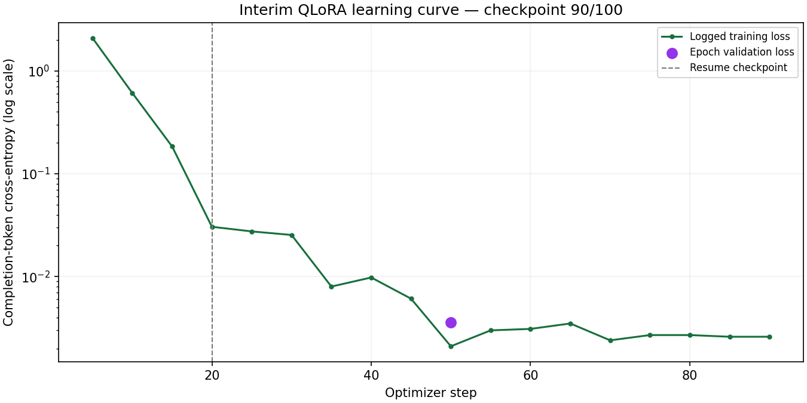

# UltraMedia fine-tuning experiment report

## Current handout-alignment update

Training, the original GPU comparison and matched local comparison are complete. The explicit-schema GPU adapter arm is interrupted awaiting capacity. [Classification results](DISPOSITION_RESULTS.md), [five new task probes](HANDOUT_SMOKE_RESULTS.md), and the [handout project guide](../project/README.md) now supplement the evidence. The new probes score rules5/5, base3/5, adapter3/5; human editorial benefit remains unmeasured. Older dated progress descriptions below are historical snapshots.

**Snapshot:** 2026-09-09T07:31:52.454694+00:00
**Status:** training and matched local comparison completed; stronger GPU prompt control pending. The checkpoint-90 snapshot below is preserved as history, followed by the verified training-completion update. Human editorial review and production promotion remain pending.

## 1. Research question and project scope

Can parameter-efficient supervised fine-tuning make a small race-reporting model follow a structured editorial contract more reliably than its unadapted base, given identical source evidence and a strong prompt?

The model learns a behavior: produce concise cited drafts when the requested facts are supported, and abstain when they are missing or contradictory. Current race facts remain in the request's evidence and timing records. The adapter is not a database of race results. The teaching lab's intent-classification SFT workflow is adapted to structured generation and abstention, so the relevant automatic metrics differ from classification accuracy/F1. This experiment does not claim pretraining, RLHF, DPO, or a LoRA-versus-QLoRA ablation.

## 2. Data and objective

The versioned research dataset has **600 synthetic examples**: 400 train, 80 validation and 120 test, grouped into 150 fictional race episodes. A group never crosses splits. Each example contains system/user/assistant messages, structured inputs, target JSON, provenance, a group ID and a content hash. Five evidence conditions and four signal types are balanced; details and a full inventory are in the [data report](DATA_REPORT.md).

The objective is completion-only causal language-model loss. Prompt tokens receive label `-100`; assistant completion tokens provide the supervised target. The actual TRL collator is inspected to ensure both masked and supervised tokens exist. The existing CPU API test measured 424 masked and 116 supervised tokens for its test example, using a tiny random architecture; that is an API/masking test, not target-model training evidence. The completed GPU manifest independently records the same 424 masked and 116 supervised token counts.

## 3. Frozen training configuration

| Setting | Value / implementation |
|---|---|
| Base | `Qwen/Qwen3-4B-Instruct-2507` |
| Immutable revision | `cdbee75f17c01a7cc42f958dc650907174af0554` |
| Training prompt | `evidence-editor-v2` |
| Dataset SHA-256 | `5c148b3d1e57a989e38c55e73f1d46ae0b5b17227be154457953bac2dcaef8cf` |
| Method | SFT with LoRA adapters over a frozen 4-bit base |
| Quantization | NF4 with double quantization |
| Compute precision | Recorded `torch.bfloat16`; the runtime support check selected BF16. Do not infer precision from the GPU name. |
| LoRA rank / alpha / dropout | 16 / 32 / 0.05 |
| Target modules | `q_proj`, `k_proj`, `v_proj`, `o_proj`, `gate_proj`, `up_proj`, `down_proj` |
| Bias / task | None / causal LM |
| Epochs / planned optimizer steps | 2 / 100 |
| Microbatch / accumulation | 1 example / 8 steps, effective batch of 8 on one GPU |
| Learning rate / schedule | 0.0002 / cosine decay; warmup ratio 0.05 |
| Optimizer | Paged AdamW, 8-bit optimizer state |
| Sequence limit / packing | 2048 tokens / disabled |
| Checkpointing | Non-reentrant gradient checkpointing; model cache disabled during training |
| Validation / selection | Every epoch; lowest validation loss; load best checkpoint at end |
| Recovery snapshots | Every five optimizer steps, in addition to epoch checkpoints |
| Seed | 42 for model/data |
| Hardware observed | Google Colab NVIDIA T4, 15,360 MiB VRAM |
| Runtime observed | Python 3.13.15; torch 2.8.0; matching torchvision 0.23.0 and torchaudio 2.8.0 |

Source of configuration: [training.py](../../backend/src/ultramedia/training.py), [pinned GPU requirements](../requirements-gpu.txt), and [portable notebook](../notebooks/UltraMedia_Week5_QLoRA.ipynb). The setup guide recommends Python 3.11/3.12; the actual hosted runtime is explicitly reported as 3.13.15. The final run manifest must retain resolved package versions rather than assuming they match the guide.

## 4. Observed interim training data

At checkpoint **90**, the latest logged training loss is **0.0026**. The first epoch validation loss is **0.0036062703**, and checkpoint 50 is the best validation checkpoint so far. The final epoch's validation and final selected adapter are still pending in this snapshot. Each plotted training point is the trainer's logged interval loss; validation is an epoch-level measurement, not a second training series.

The [JSON receipt](data/training-progress.json) and [CSV history](data/training-history.csv) are extracted from the checksum-verified checkpoint archive. The plot uses a logarithmic loss axis. The dashed line marks the checkpoint used to resume the interrupted run. Some token counters restart after resume, so cumulative counter values must not be summed or described as total experiment compute. The final training timer covers only the resumed invocation, excluding earlier interrupted work and setup/download time.

Low loss and high teacher-forced token accuracy are plausible on repetitive synthetic templates. They do **not** establish free-generation reliability, editor preference, or generalization to real races. Independent held-out generation and the stronger prompt control are necessary to interpret value.

## 5. Three separately declared comparisons

| Comparison | Same across base and adapter | What changes from other comparisons | Status at report snapshot |
|---|---|---|---|
| Original GPU | Exact base revision, frozen 120 cases, original prompt, NF4, greedy decoding, max 1024 new tokens | Original training prompt | Completed: 44/120 base, 120/120 adapter |
| Stronger GPU prompt control | Same adapter, cases, model revision, NF4 and decoding | Exact output JSON schema appended to both models' system prompt; decoding itself unconstrained | Running |
| Matched local deployment | Exact base lineage, same F16-to-Q4_K_M conversion, Mac/runtime, 120 cases, local-serving prompt, JSON-schema constrained decoding, temperature 0, seed 42, max 1024 tokens | Different quantization/runtime and stronger decoding safeguard | Completed: 76/120 base; 109/120 adapter |

The [stronger prompt control](../SCHEMA_CONTROL.md) was declared before GPU test outputs were available, after a separate local probe revealed that the original prompt did not spell out the nested `value` key. Its declaration is commit `d6e55b559151b060a682988a541e41a709733d3f`. It prevents an unfair claim of fine-tuning value based only on an avoidable formatting ambiguity.

The [matched local protocol](../LOCAL_SERVING_EVALUATION.md) was committed at `31c7c0df2b585a5df1ecf38e7e280f6081174099` before evaluating the converted pinned base. The earlier Ollama-tag browser demo is a separate unadapted example, not an equivalent controlled base. Do not combine percentages from these different conditions.

## 6. Metrics and result interpretation

All 120 test cases remain in each model's denominator, including exceptions, invalid JSON and invalid contracts. The nine checks are schema validity, citation-ID validity, supported structured claims, required metric coverage, correct disposition, supported numeric tokens, selected sensitive-language checks, projection-versus-achievement wording, and the conjunction of all automatic checks.

For each comparison, report base and adapter counts and rates, absolute percentage-point changes, per-signal and per-condition breakdowns, and a paired 95% group-bootstrap interval using 1,000 resamples of race groups with seed 42. The interval reflects this synthetic grouped sample; it does not establish real-world coverage. Preserve raw outputs, parsed outputs, error types, input/output token receipts, latency and memory. Generated errors contribute to the denominator rather than disappearing from the report.

The independent verifier recomputes checks from the original inputs and saved raw outputs, confirms the exact test IDs/order/hashes, recomputes latency and subgroup rates, and regenerates the paired comparison. Full downloads also verify adapter bytes against the training manifest. Public metadata-only verification cannot substitute for the original full-weight checksum verification.

**Decision rule:** prioritize the stronger shared-prompt result. If prompting closes the gap, report that prompting is sufficient for these automatic checks. If the adapter retains an advantage, describe its measured synthetic-task scope. Inspect regressions and unsuccessful cases either way. Human editorial preference and real-race quality remain unmeasured until a blind review is actually completed.

The separately verified local base arm passed all automatic checks on 76/120 cases (63.3%). This is not a fine-tuning gain. The completed [matched comparison](LOCAL_COMPARISON_RESULTS.md) measures 109/120 adapter success, a 27.5 percentage-point gain with a paired 95% interval of 20.0–35.0 points. It includes all raw outputs, subgroup results and lexical-metric limitations.

## 7. Executed application evidence

The real local Qwen demonstration passed 13 browser software checks and the backend suite passed 33 tests. It exercises retrieval, generation, validation, six workflow stages, review authentication, unsupported-edit rejection, revision history, stale-write rejection and mobile/download behavior. A saved revision also survived an actual API restart. The separate local-model workflow suite passed its four retrieval cases and failed both generation cases; those failures remain visible.

Real testing found a wrong JSON property name and unsupported derived numeric text. Local serving now constrains JSON structure; fact validators still reject unsupported numbers. The workflow-check endpoint now returns a complete FAIL report instead of crashing on an invalid model response. Accessible editor labels and clean-install dependency issues were fixed. The patched frontend passed another full browser run and GitHub CI; its registry audit reported zero known vulnerabilities at the recorded snapshot. None of those software results constitute human editorial approval.

Evidence: [local demo](../evidence/local-serving/), [browser regression](../evidence/dependency-regression.json), [dependency validation](../evidence/dependency-validation.json), [pytest](../evidence/pytest.xml), [end-to-end narrative](../END_TO_END.md).

## 8. Execution and recovery ledger

| Event | Observed behavior | Resolution / interpretation |
|---|---|---|
| Initial setup | torch/torchvision ABI mismatch before training | Pin compatible vision/audio packages; no training result attributed to this failed setup |
| First training runtime | Ended around step 15; no checkpoint retained | Preserve failed-attempt history; reason for runtime termination not established |
| Second runtime | Ended around step 23; checkpoint 20 retained | Restore adapter, optimizer, scheduler, RNG and trainer state into the same run |
| Current continuation | Resumed checkpoint 20 using the same experiment identity | Original source `8be44c2`; recovery/evaluation source `99c4405`; settings unchanged |
| File transfer interruption | Contents endpoint returned 404 while training and console stayed alive | Refresh the one-hour proxy credential; do not mislabel this as GPU failure |
| Ongoing artifact protection | Locally verified recovery snapshots and independent completed-stage archives | Retain latest and previous checkpoints; preserve each completed evaluation arm |

No A100 or L4 allocation was available under the current Colab quota; the T4 path continued. Local inference uses the existing Mac. Kaggle and paid cloud options are documented but not claimed as executed or purchased. See [compute options](../COMPUTE_OPTIONS.md).

## 9. What must be appended before final submission

The final report must add the actual selected checkpoint and adapter hashes, both epoch validation losses, actual trainable parameter count and VRAM, honestly scoped training duration, all three comparisons, representative successes and failures selected without outcome cherry-picking, conversion lineage, and actual adapted-model application checks. Every claim needs a saved artifact path and verified source identity. Publish bounded reports in Git and retain large weights/full archives separately. Preserve this interim history so the final report remains auditable.

All reference episodes are fictional; all 600 targets are unapproved synthetic references. Automatic checks do not prove semantic entailment, fairness, medical safety or editorial usefulness. Human review and production promotion stay separate from completion of the research software and evidence PR.

## Training completion update

Training completed all 100 optimizer steps. The verified manifest records **33,030,144 trainable parameters**, **5,846.886 seconds (97.448 minutes)** for the resumed invocation, **4,384,457,216 bytes** peak allocated GPU memory and **5,903,482,880 bytes** peak reserved memory. The actual runtime dtype is **torch.bfloat16**, correcting the earlier hardware-based FP16 assumption. This is a manifest observation, not a claim of native hardware acceleration. The training settings have not been changed.

Validation loss was **0.0036062703** at epoch 1 and **0.0018770788** at epoch 2; checkpoint **100** is the selected best checkpoint. The real GPU collator recorded **424 masked prompt tokens and 116 supervised completion tokens** for its inspected first example. Adapter bytes were checked against every saved SHA-256 before merging for local inference. The [final training manifest](data/final-training/training-run.json) and [verification receipt](data/final-training/verification.json) retain the configuration, history, environment and source hashes. The checkpoint-90 plot above remains an explicitly interim historical snapshot.

The original GPU generation comparison is completed; neither low loss nor this completed training stage establishes a fine-tuning gain. The matched local comparison is now independently verified; both The stronger GPU prompt control remains pending. Actual adapted-model application checks are recorded separately.

[Complete training history CSV](data/final-training/training-history.csv). The plotted losses measure teacher-forced completion prediction, not free-generation success.

## Adapted-model application update

The verified, merged Q4_K_M adapter completed all 13 browser software checks. The separate workflow quality suite failed one of two generation cases (record watch); all four retrieval cases passed. [Full evidence and failure analysis](../evidence/adapter-serving/README.md). Automated review actions remain synthetic QA with training consent false.

## Original GPU comparison completed

The original-prompt NF4 comparison is now fully verified: **44/120 base versus 120/120 adapter**, a **63.3 percentage-point difference** (paired 95% group-bootstrap interval 57.5–70.0). The [complete report](ORIGINAL_GPU_RESULTS.md) retains all raw outputs, subgroup rates, timing, memory and failure interpretation. The stronger shared-schema GPU control is running; interpret the original result with its formatting ambiguity and do not treat 100% synthetic automatic success as human approval.
