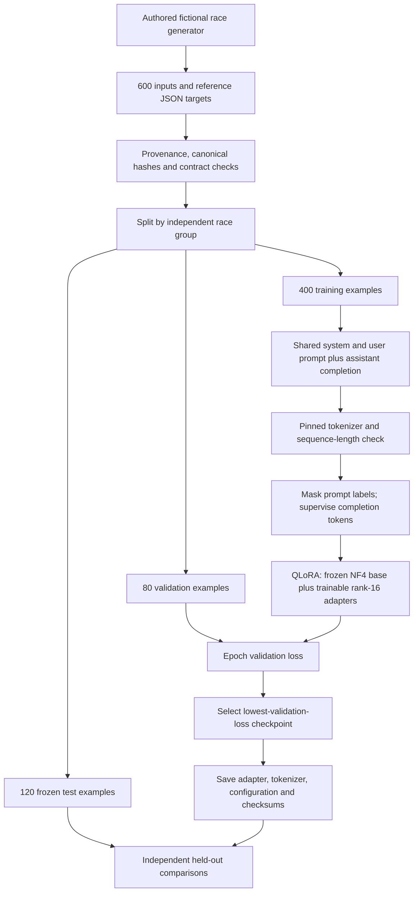
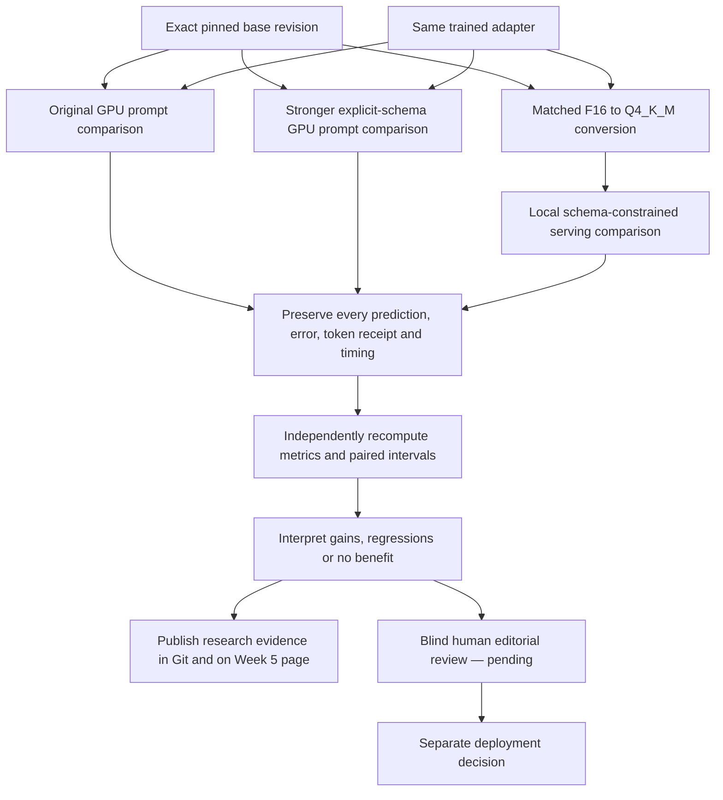
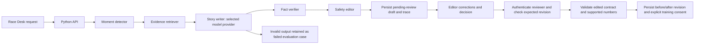
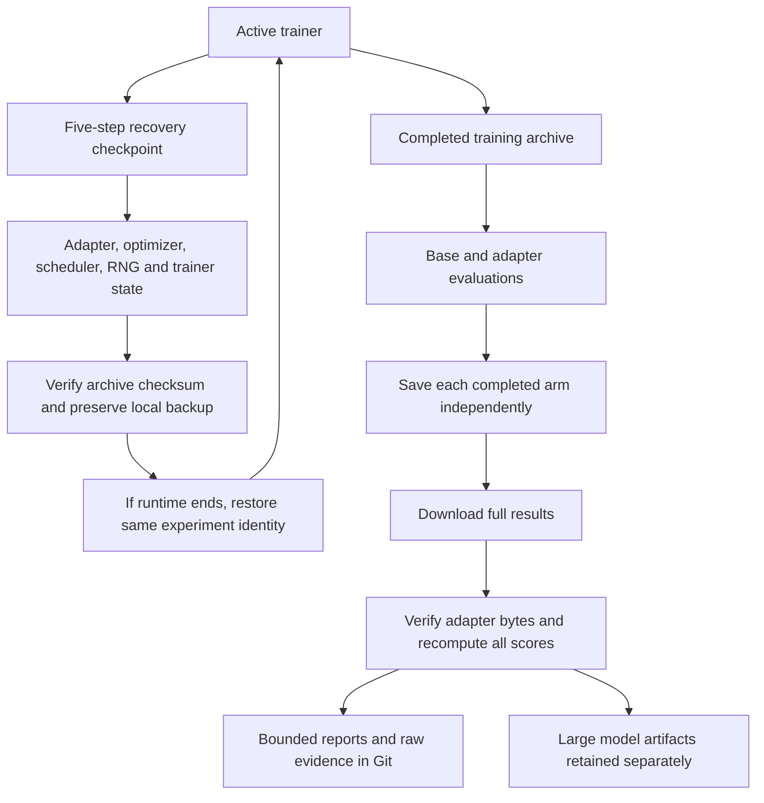

# Training, evaluation and application flows

The diagrams describe implemented paths and separately marked pending work. Execution status is recorded in the [fine-tuning report](FINE_TUNING_REPORT.md); the existence of a script or arrow does not imply that its stage has completed.

## 1. Data-to-adapter flow



Training facts are inputs to the task, not instructions from an external document. Headline hints and retrieved text are treated as untrusted evidence. The fixed system contract governs generation. Test examples do not contribute gradient updates or checkpoint selection.

## 2. Comparison and release flow



Each comparison has two arms and the same 120 held-out cases. The original and stronger GPU comparisons use NF4 and greedy generation. The local comparison uses Q4_K_M and constrained decoding; its scores remain separate. The stronger prompt interpretation is central: a weak prompt baseline is insufficient evidence that adaptation is needed. Finishing the research PR does not approve production model promotion.

## 3. Application inference and review flow



The provider must return a valid structured story; the workflow does not silently substitute deterministic text when a model fails. Numeric validation and selected safety checks are separate from schema-constrained decoding. Invalid model responses fail generation; workflow evaluation reports failures rather than hiding them or crashing the entire suite. Persisted approval is a review decision, not an automatic external publication action.

## 4. Recovery and evidence flow



Restoration preserves the configured dataset, seed, epoch count, sequence length and optimizer state. A refreshable file-transfer credential is different from runtime health: the active console and training can survive its expiry. Connection refresh, checkpoint backups and completed-stage backups are operational recovery mechanisms, not changes to the scientific comparison. Record interruptions and disclose that the training timer covers only the resumed invocation.

## 5. Reproduce the data and software checks

From the repository root:

```bash
python -m venv .venv
.venv/bin/python -m pip install -e 'backend[dev]'
.venv/bin/python -m pytest backend/tests
PYTHONPATH=backend/src .venv/bin/python week5/scripts/check_submission.py
npm ci --registry=https://registry.npmjs.org
npm run build
```

For browser-to-model reproduction, follow [END_TO_END.md](../END_TO_END.md). Use a separate synthetic QA database and private reviewer credential; those test approvals must not enter the training corpus. The registry audit and browser results are timestamped evidence, not a perpetual guarantee about future dependencies or outputs.

## 6. Reproduce training and comparisons

Use a fresh CUDA environment and the supplied notebook/source archive. The notebook checks the source manifest and installs pinned direct dependencies. The available memory and actual resolved environment must be measured in that session.

```bash
python -m pip install -r week5/requirements-gpu.txt
PYTHONPATH=backend/src python -m ultramedia.training train \
  --dataset week5/data/synthetic --output week5/runs/RUN \
  --research-synthetic --epochs 2 --max-length 2048

PYTHONPATH=backend/src python -m ultramedia.training evaluate \
  --dataset week5/data/synthetic --run week5/runs/RUN \
  --max-new-tokens 1024

PYTHONPATH=backend/src python -m ultramedia.training evaluate \
  --dataset week5/data/synthetic --run week5/runs/RUN \
  --schema-control --resume-evaluation --max-new-tokens 1024
```

Use a new run directory for an independent run. A genuine recovery additionally specifies `--resume-from-checkpoint` within the same run; the runner rejects configuration/identity mismatches. Do not rerun selected test cases to replace inconvenient outcomes. Completed-variant reuse validates IDs, hashes, model identity and decoding settings before accepting saved evidence.

## 7. Verify saved artifacts independently

After safely extracting the complete result archive:

```bash
PYTHONPATH=backend/src python week5/scripts/verify_gpu_run.py week5/runs/RUN
PYTHONPATH=backend/src python week5/scripts/verify_gpu_run.py \
  week5/runs/RUN --schema-control
```

The default verifies the actual adapter bytes. `--metadata-only` is appropriate for the public report bundle that intentionally excludes large weights; it does not prove the downloaded weight files match. Verification must use all cases and regenerate the comparison rather than trusting a summary percentage. The paired review answer key is kept separate from blind human review material.

For conversion and deployment, use the [serving guide](../SERVING.md) and [predeclared local protocol](../LOCAL_SERVING_EVALUATION.md). Record the exact converter/runtime revisions, base-model lineage, input/output artifact hashes, command arguments and precision. Re-run both arms at the same precision before attributing a change to the adapter rather than quantization or a changed prompt.

## 8. Final artifact ledger

| Artifact | Purpose | Expected disposition |
|---|---|---|
| Dataset JSONL and manifest | Exact prompts, reference targets and data identity | Committed now |
| Dataset inventory and distribution CSV | Reviewer-friendly full data accounting | Committed with these reports |
| Interim training receipt, history and curve | Actual progress trace without a fabricated final result | Committed with these reports |
| Final training manifest and loss curves | Selected checkpoint, package versions, resources and loss mask | Verified and committed in `data/final-training` |
| Original and schema-control raw predictions/reports | Recompute all GPU conclusions | Append after both arms complete |
| Local conversion lineage and matched predictions | Distinguish model adaptation from deployment changes | Verified local comparison committed |
| Browser/API receipts and failures | Verify product behavior and failure handling | Both demonstrations committed; adapted quality suite still FAIL |
| Human review forms | Editorial preference with reviewer identity and rationale | Remain unfilled until actual human review |
| Adapter/checkpoint/merged weights | Recovery and local reproduction | Retain full downloads separately; hashes and metadata in Git |

The background completion task must update the fine-tuning report, data/flow reports where affected, machine-readable results and evidence ledger before the final PR merge. Any negative result remains part of the submission.

## Completed local comparison verification

```bash
PYTHONPATH=backend/src python week5/scripts/verify_local_comparison.py \
  week5/evidence/local-comparison --metadata-only
```

To verify downloaded model bytes, omit `--metadata-only` and provide `--base-model PATH_TO_BASE_GGUF --adapter-model PATH_TO_ADAPTER_GGUF`. The archived exact evaluator records original execution; the model lineage JSON contains converter, quantizer and artifact hashes. See the [full paired report](LOCAL_COMPARISON_RESULTS.md).
